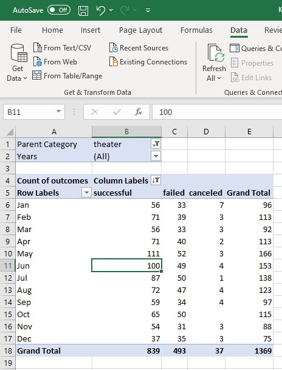

# Kickstarting with Excel

## Overview of Project

### Purpose

The purpose of this project is to form an analysis of the outcomes (failed, successful, canceled) of theater and play Kickstarter campaigns against the launch date and goals of those campaigns. This analysis required the use of pivot tables as well as graphing tools and statistics functions within Excel. The analysis should provide insight into Kickstarter campaigns and determine whether the length and funding goal of a campaign provide a trend to determine the rate of success.

## Analysis and Challenges

### Analysis of Outcomes Based on Launch Date

In order to analyze the outcomes of theater campaigns based on their launch date, I utilized pivot tables and graphing tools within Excel to determine if there is a trend in the length of a campaign and its success.  I created a pivot table using the outcomes as the columns and date as the row. The values were the count of outcomes in those specific parameters. The data appears clunky at first, but I was able to clean it up for analysis utilizing the filtering tools in Excel. Filtering the 'Date Created' value in the rows field, I set the value to display the month only.  By adding the Parent Category filter to the whole chart, I gather data pertinent to the theater based Kickstarter Campaigns.  Additionally, I added a Year filter to the whole chart to allow for more specific analysis of certain years, though I leave it on (All) years to allow for the most accurate data.

In order to make this data more visually friendly, I utilized a line chart, as they are typically more helpful when trying to determine trends.

### Analysis of Outcomes Based on Goals

In order to analyze the outcomes based on the funding goal, I utilized the COUNTSIF() function in Excel to filter the Subcategory column for plays against the Goal and Outcome columns. After tallying the data, I calculated the percentage of each outcome by dividing the counts of each outcome by the total number of campaigns in that category.

Once again, I used a line graph to visualize the data to best portray the trends of each outcome against the goal for each campaign.

### Challenges and Difficulties Encountered

One of the biggest challenges in this project was utilizing the COUNTSIF() function to properly grab the data necessary for the outcomes based on funding goals. Finding the proper logic statements and parameters to use was difficult at first.  I made many syntax errors that yielded botched data. After doing some research into the function, I was able to correct the parameters to yield accurate data.

## Results

- What are two conclusions you can draw about the Outcomes based on Launch Date?
1. Based on the data studied, the month of May launched the most amount of Theater Kickstarter Campaigns. This can provide invaluable knowledge supporting the assumption that starting a campaign in May provides the highest chance of success.
2. Based on the data studied, the months of June through September portrayed a steep decline in successful campaigns, alluding that the summer months are typically more "swingy". It could be reasonably assumed that as the year progresses, people tend to donate less. In order to confirm/refute this claim, further analysis would be necessary using the data from the amount of backers along with average donation.
- What can you conclude about the Outcomes based on Goals?
1. Based on the data studied, plays tend to be more successful when they have a funding goal of $5,000 or less. As the goal increases, the percentage of successful campaigns steadily drops.  
2. Based on the data studied, in the $35,000-45,000 range, we see a high success rate, though these numbers are outliers and are not reflective of the data as a whole. This can be confirmed by taking the 3rd Quartile data and adding it to the IQR multiplied by 1.5.
- What are some limitations of this dataset?
Some limitations of this data is that it is 4 years old. 4 years is a long time to accumulate more data. Additionally, there are other sources of funding projects other than Kickstarter. In order to determine a more accurate measure of success in crowdfunding campaigns, data from those other platforms would be necessary.
- What are some other possible tables and/or graphs that we could create?
We could utilize the clustered bar graph as a means of portraying the magnitude of the difference between each outcome.
