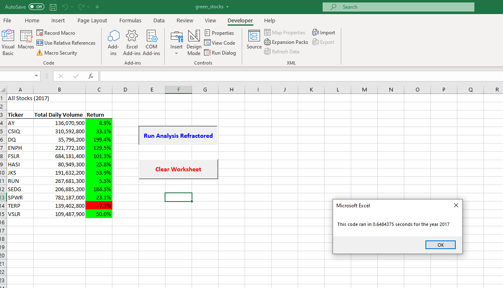
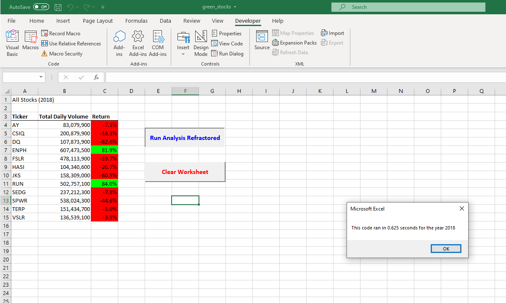

# Stock Analysis with VBA & Excel

## Overview of Project

### Purpose
In this project, I was tasked with editing, or refactoring, the Stock Market dataset with VBA code to loop through all of the data at one time to collect an entire dataset.  Afterwards, I determined whether refactoring the code made the VBA script run quicker.  Finally, I sought to make the code more efficient by consolidating steps, using less memory, and improving the logical arguments of the code to make it more readable for future users to follow.

### Results: Executing Deliverable Requirements
1. Create a variable, tickerIndex, for the ticker index and set it equal to 0 before iterating over all rows.  This variable will be used to access the correct index across the different arrays in the next requirement.
```
For i = 0 To 11
       tickerIndex = tickers(i)
```
2. Create three output arrays: tickerVolumes, tickerStartingPrices, and tickerEndingPrices.  Set the data types to Long for tickerVolumes and Single for the other two.
```
Dim tickerVolumes As Long
Dim tickerStartingPrices As Single, tickerEndingPrices As Single
```
3. Create a for loop to initialize the tickerVolumes to 0. If the next row's ticker doesn't match, increase the tickerIndex. Additionally, increase the current tickerVolumes variable and add the ticker volume for the current stock ticker.
```
''2a) Create a for loop to initialize the tickerVolumes to zero.
    'If the next row’s ticker doesn’t match, increase the tickerIndex.
       Worksheets(yearValue).Activate
       tickerVolumes = 0

       ''2b) Loop over all the rows in the spreadsheet.
       For j = 2 To RowCount

           ' If the next row’s ticker doesn’t match, increase the tickerIndex.
           If Cells(j, 1).Value = tickerIndex Then
              '3a) Increase volume for current ticker
              tickerVolumes = tickerVolumes + Cells(j, 8).Value

           End If
```
4. Loop through the dataset, confirm all instances for that ticker are recorded into the arrays, and output the ticker, total daily volume, and return.
```
'3b) Check if the current row is the first row with the selected tickerIndex.
       'If  Then
          If Cells(j - 1, 1).Value <> tickerIndex And Cells(j, 1).Value = tickerIndex Then

              tickerStartingPrices = Cells(j, 6).Value

         'End If
          End If

       '3c) check if the current row is the last row with the selected ticker
       'If  Then
          If Cells(j + 1, 1).Value <> tickerIndex And Cells(j, 1).Value = tickerIndex Then

              tickerEndingPrices = Cells(j, 6).Value

         'End If
          End If

      Next j

   '4) Loop through your arrays to output the Ticker, Total Daily Volume, and Return.

          Worksheets("All Stocks Analysis").Activate

          Cells(4 + i, 1).Value = tickerIndex
          Cells(4 + i, 2).Value = tickerVolumes
          Cells(4 + i, 3).Value = tickerEndingPrices / tickerStartingPrices - 1

           'With Range("C4:C15")
                       '.NumberFormat = "0.0%"
                       '.Value = .Value
           'End With


  Next i
```
5. Screenshot of Results after Refactoring Code:
#### Final 2017 Analysis

#### Final 2018 Analysis


## Summary

### What are the advantages and disadvantages of refactoring code?
#### Advantages
*Code refactoring makes the code more extensible by adding functionality and flexibility.
*Refactoring code makes code much easier to understand and maintain, as well as improves the performance in which it runs.
#### Disadvantages
*Refactoring code can be very time consuming.
*Increased chance of mistakes due to multiple added levels of complexity.
#### Original VBA Script
Refactoring the original VBA script made the code much easier to read and maintain.  It eliminated the multiple instances of other variables and made the code run much quicker and more efficiently.  I didn't personally find any cons in refactoring the original VBA script.  However, due to the consolidation of multiple instances of code, a user could find issues in debugging if they make a mistake in the root declarations of any variables, functions, or logic statements.
