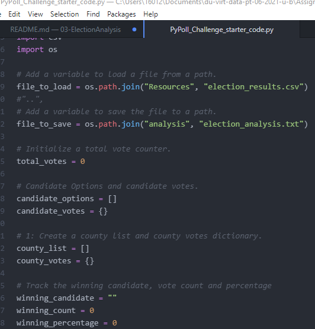

# Election Analysis using Python

## Overview of Project
A Colorado Board of Elections employee has tasked me to complete an election audit of a recent local congressional election utilizing tools such as Python, Visual Studio Code, and Git.

## Election-Audit Results
With the output file, "election_analysis.txt", created in the Analysis folder, we can answer a variety of different questions pertaining to the data set.
1. We can determine the total number of votes that were cast in this congressional election:
```
Election Results
-------------------------
Total Votes: 369,711
-------------------------
```
2. We can provide a total breakdown of the number of votes and the percentage of total votes for each county in the precinct:
```
County Votes:
Jefferson: 10.5% (38,855)
Denver: 82.8% (306,055)
Arapahoe: 6.7% (24,801)
-------------------------
```
3. We can show which county had the largest number of votes:
```
-------------------------
Largest County Turnout: Denver
-------------------------
```
4. We can provide a total breakdown of the number of votes and percentage of total votes each candidate received:
```
-------------------------
Charles Casper Stockham: 23.0% (85,213)
Diana DeGette: 73.8% (272,892)
Raymon Anthony Doane: 3.1% (11,606)
-------------------------
```
5. We can provide the candidate that won the election, as well as the data on their percentage of total votes and total vote count:
```
-------------------------
Winner: Diana DeGette
Winning Vote Count: 272,892
Winning Percentage: 73.8%
-------------------------
```

## Election-Audit Summary
For this task, I created a python script that reads and extracts data from a targeted CSV file, creates and uses various data structures, and uses boolean and logical operators to loop over the
data and perform mathematical operations on the data.

This script is very "black and white", meaning the variables are generically called.  This allows the script to have flexibility in being used for other elections.  If the other source file follows the same format as the CSV I pulled from,
then simply changing the path declarations to the new file would be all that is necessary.  


Another benefit to this code is that it can be modified easily to accommodate more data.  For example, if an election allowed write ins or combined voting for candidates and initiatives at once (popular in the recent 2020 election), you would simply have to write the logical functions for the new additions and not the entire script.  This would allow time to run more complex analyses and give the programmer more time to iron out the bugs in the more complex code.
