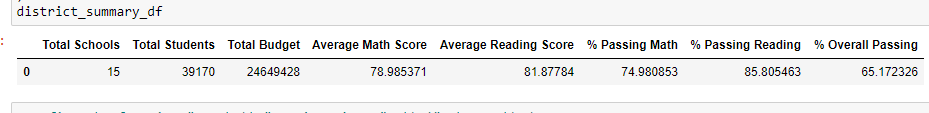
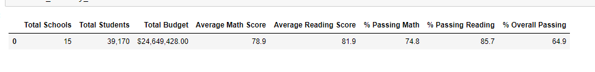
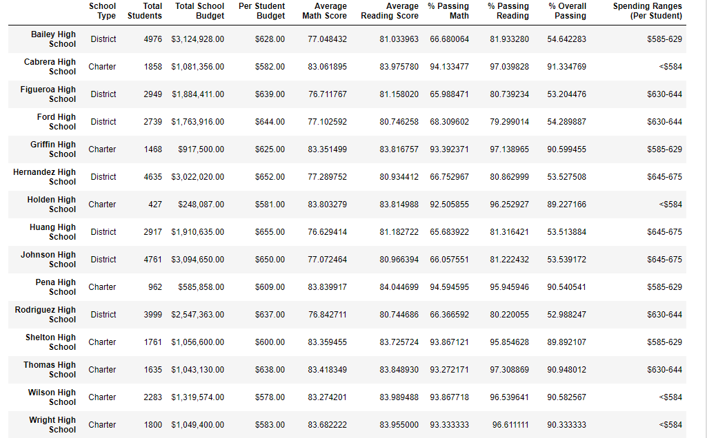
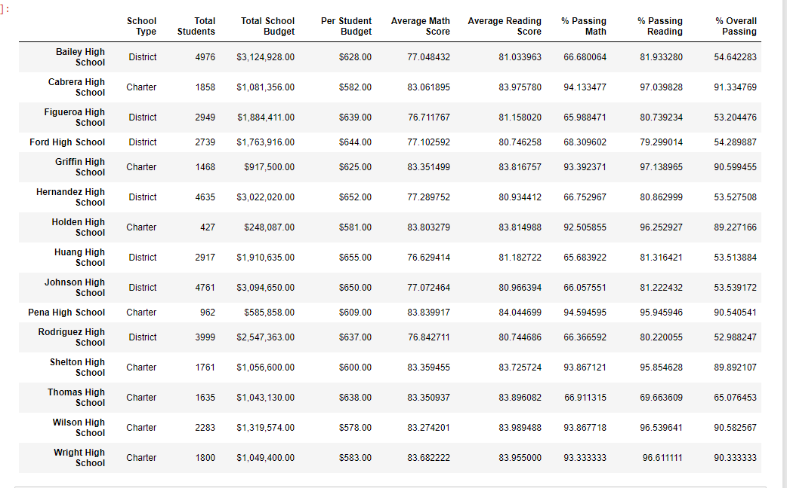
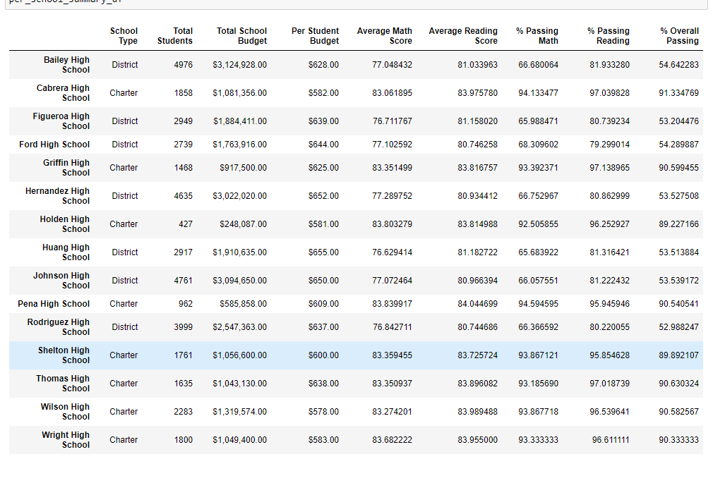

# School District Analysis with Jupyter and Pandas

## Overview of Project
The school board has notified Maria and her supervisor that the students_complete.csv file shows evidence of academic dishonesty; specifically, reading and math grades for Thomas High School ninth graders appear to have been altered. Although the school board does not know the full extent of the academic dishonesty, they want to uphold state-testing standards and have turned to Maria for help. She has asked you to replace the math and reading scores for Thomas High School with NaNs while keeping the rest of the data intact. Once you’ve replaced the math and reading scores, Maria would like you to repeat the school district analysis that you did in this module and write up a report to describe how these changes affected the overall analysis.

## Results

### How is the district summary affected?
* The average math score went from 79.0 to 78.9
* The average reading score remained unchanged at 81.9
* The percentage of passing math dropped from 75 to 74.8
* The percentage of passing reading dropped from 85.8 to 85.7
* The percentage of overall passing dropped from 65.2 to 64.9
#### District with "Dishonest" Scores

#### District with NaN

### How is the school (Thomas High School) summary affected?
* The average math score decreased from 83.42 to 83.35
* The average reading score increased from 83.85 to 83.9
* The percentage passing math drastically decreased from 93.3 to 66.9 -- When accounting for only 10-12th grade, the percentage was 93.2.
* The percentage passing reading also drastically decreased from 97.3 to 69.7 -- When accounting for only 10-12th grade, the percentage was 97.0.
* The percentage of overall passing decreased from 90.95 to 65.08 -- When accounting for only 10-12th grade, the percentage was 90.6.

### How does replacing the ninth graders’ math and reading scores affect Thomas High School’s performance relative to the other schools?
Thomas High School drops out of the top 5 after adjusting the 9th grade values to NaNs.  If only considering the 10-12th grade, then THS is still in the top 5

### How does replacing the ninth-grade scores affect the following:

#### Math and Reading score by grade:
* Since the 9th grade was the only grade affected by NaNs, their scores are discarded, dropping the average of all 9th grade scores for the district slightly.  The 10th-12th grade scores were unaffected.

#### Scores by school spending:
* Thomas High School has a higher budget than most ($638 per student).
* By replacing the grades with NaN, the overall passing percentage and averages drastically dropped, contributing to the results of the budget analysis that higher budget schools have lower averages.

#### Scores by school size:
* Thomas High School is a medium sized school and adjusting the scores provided no significant changes in observation.

#### Scores by school type:
* Thomas High School is a Charter school, so the changes do carry an effect on the Charter school averages.
* The score average difference were not changed enough to carry much significance.
* The percentages of passing math, reading, and overall were drastically decreased enough to drop the averages for Charter schools, if the district chooses to use the NaNs vs only counting 10-12th grade.

### Summary
There is certainly cause to believe that academic dishonesty could have occurred based on the data gathered.  By including the scores, Thomas High School placed much higher in the standings of other schools.  By replacing the scores with NaNs, the averages of passing math, reading, and overall drastically drops.  By counting the data from only the 10th-12th graders at THS, they still place well in the standings but are lower than with the doctored scores.  However, the difference could be argued to be negligible due to similarity in scores in compared with the other grades.  Using only the NaNs would not only skew the data for THS, but also the whole district.  It lowers the success of Charter schools slightly and further swings data alluding to a higher budget equaling lower grades.  

#### Overall with "Dishonest" Scores

#### Overall with NaNs

#### Overall with NaNs only accounting 10-12th Grade (Valid Scores) for THS

