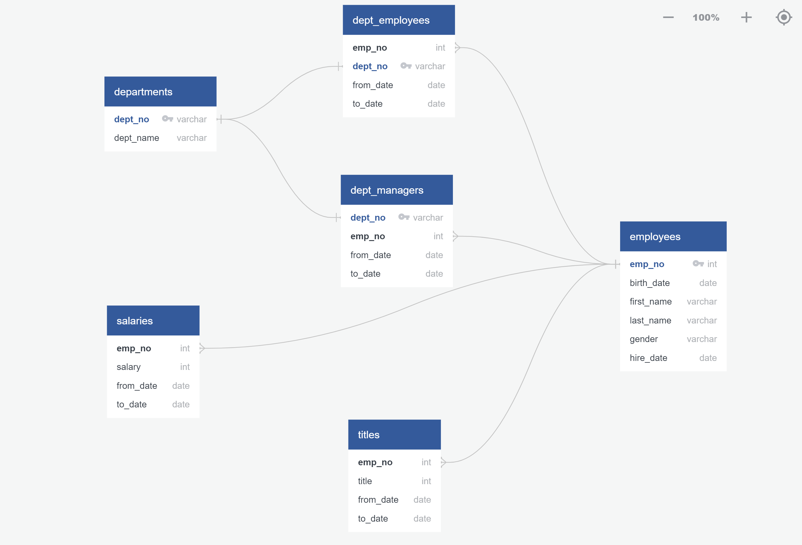
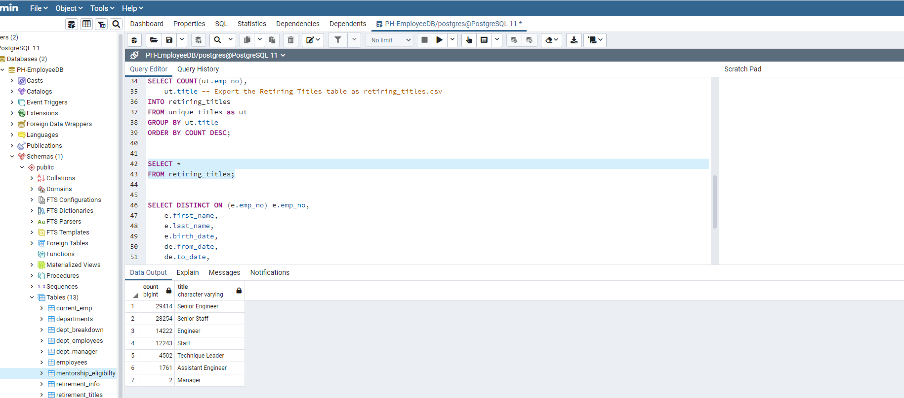

# Pewlett-Hackard Analysis with SQL

## Overview of Project
Bobby's manager has given the directive to determine the number of retiring employees per title and identify employees who are eligible to participate in a mentorship program to train new employees in preparation for the "silver tsunami" of employees leaving.

## Results
By utilizing a SQL database (Postgres 11), creating entitiy relationship diagrams (ERDs), and importing/exporting large CSV employee datasets, I was able to perform an analysis on the resulting data and complete the directive ordered by Bobby's manager.

The image below shows the connections between the datasets through primary and foreign keys, allowing me to start with a sound data model:

Utilizing the model in QuickDBD, I created a schema for each of the CSV files; specified data types, primary keys, foreign keys, and other constraints provided by Bobby's manager (i.e. retirement based on DOB, department, and title).

### Query 1: List of Retirement-Ready employees
For the first query, I retrieved the employee number, first name, and last name from the Employees table; then retrieved the title, from date, and to date from the Titles table.  Next I created a new table and performed an `INNER JOIN` on both tables on the primary key.  Upon exporting and analyzing the table, I found there were 133,776 employees listed for retirement.

### Query 2: Cleaning the Retirement-Ready data
For the second query, I needed to parse the duplicated entries for the employees who have switched titles over the years while employed at Pewlett-Hackard.  First, I retrieved the employee number, first and last name, and title columns from the Retirement Titles table.  Next, I used the DISTINCT ON method to retrieve the first occurrence of the employee number for each set of rows defined by the `ON ()` clause.  Next, I created a Unique Titles table using the `INTO` clause and sorted the table in ascending order by the employee number and descending order by the last date (`to_date`) of the most recent title. Upon exporting and analyzing the table, I found that the total number of employees actually retiring is 90,398.

### Query 3: Determining the number of employees in each position retiring
For the third query, I retrieved the number of titles from the Unique Titles table and created a Retiring Titles table to hold the required information.  I grouped the table by title, then sorted the count column in descending order.  Upon exporting the table, I had the counts of each position retiring:

### Query 4: Determining the number of employees eligible for the Mentorship program
To determine the number of mentorship-eligible employees, I started by retrieving the employee number, first and last name, and birth date from the Employees table. Next, I retrieved the from date and to date columns from the Department Employees table and retrieved the title from the Titles table.  using a `DISTINCT ON` statement, I retrieved the first occurrence of the employee number for each set of row defined by the `ON ()` clause.  I then created a new table and used the `INNER JOIN` method to joing the Employees and Deparment Employees tables on the primary key.  I used another `INNER JOIN` method to join the Employees and Titles table on their primary key as well.  Next, I filtered the data on the to_date column to all current employees, then filtered the data on the birth_date column to those employees born between Jan. 1, 1965-Dec. 31, 1965.  Upon exporting and analyzing the data, I found that 1,549 employees are eligible for the mentorship program.

## Summary
After utilizing the tools at my disposal, I am able to answer Bobby's manager's main two questions:

### How many roles will need to be filled as the "silver tsunami" begins to make an impact?
Based on the cumulative employees leaving from each title, seen in the Unique_Titles.csv file, there will be 90,398 employees that will be retiring.

### Are there enough qualified, retirement-ready employees in the departments to mentor the next generation of Pewlett-Hackard employees?
Based on the data gathered in the Mentorship_Eligibility.csv file, there will be 1,549 available employees for the mentorship program.  Based on these numbers, the "silver tsunami" will hit hard, as there are significantly more employees retiring than those eligible for the mentorship program.  Each eligible employee would need to be capable of training 58.36 new-hires each for a flawless transition.
