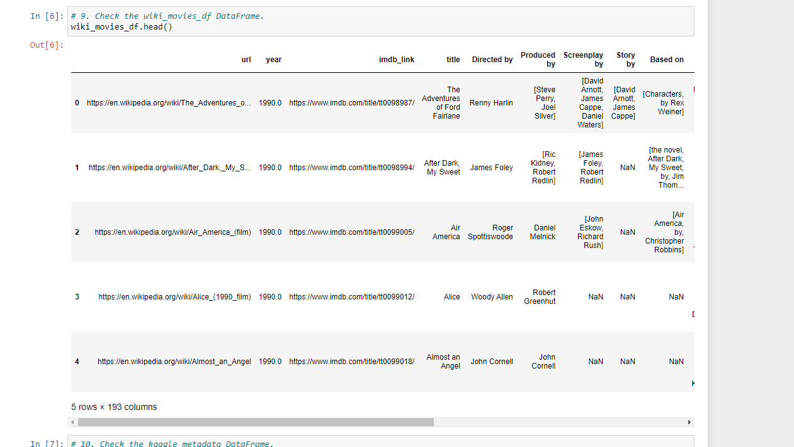
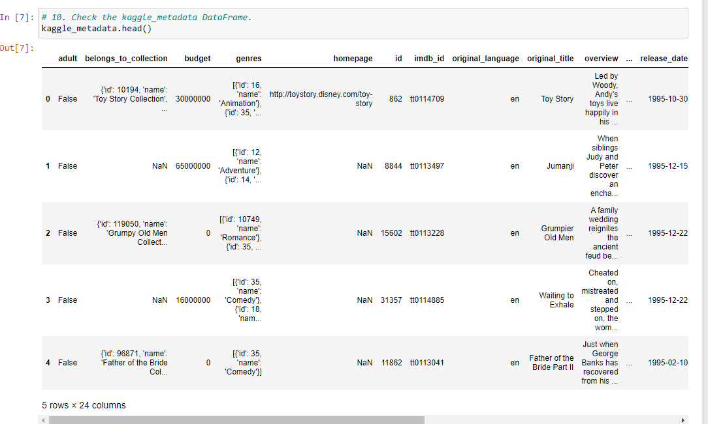
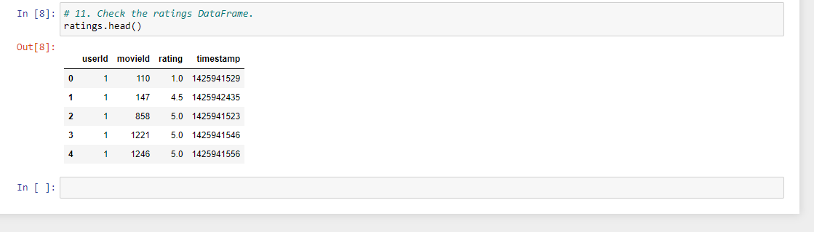
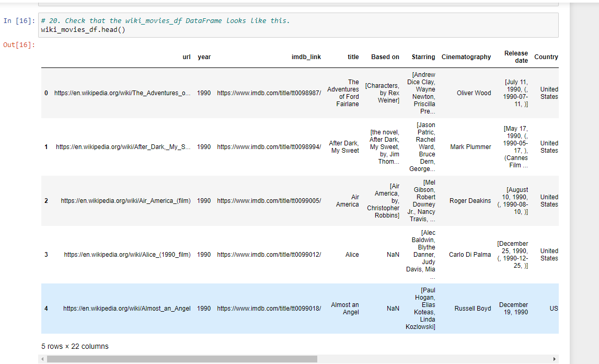
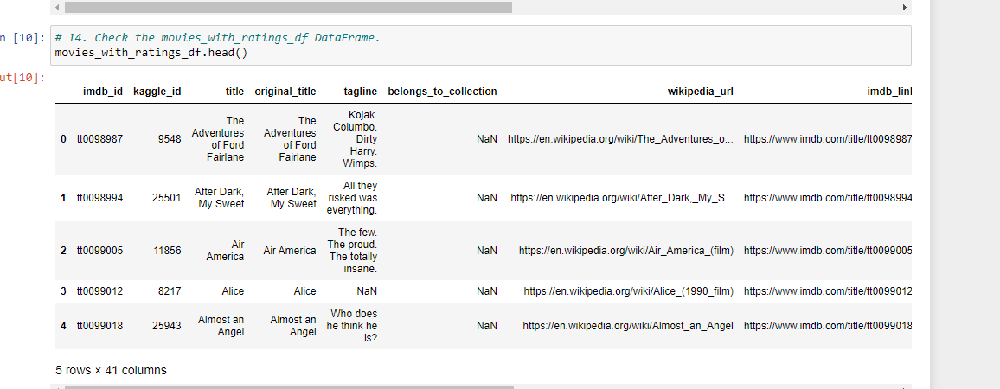
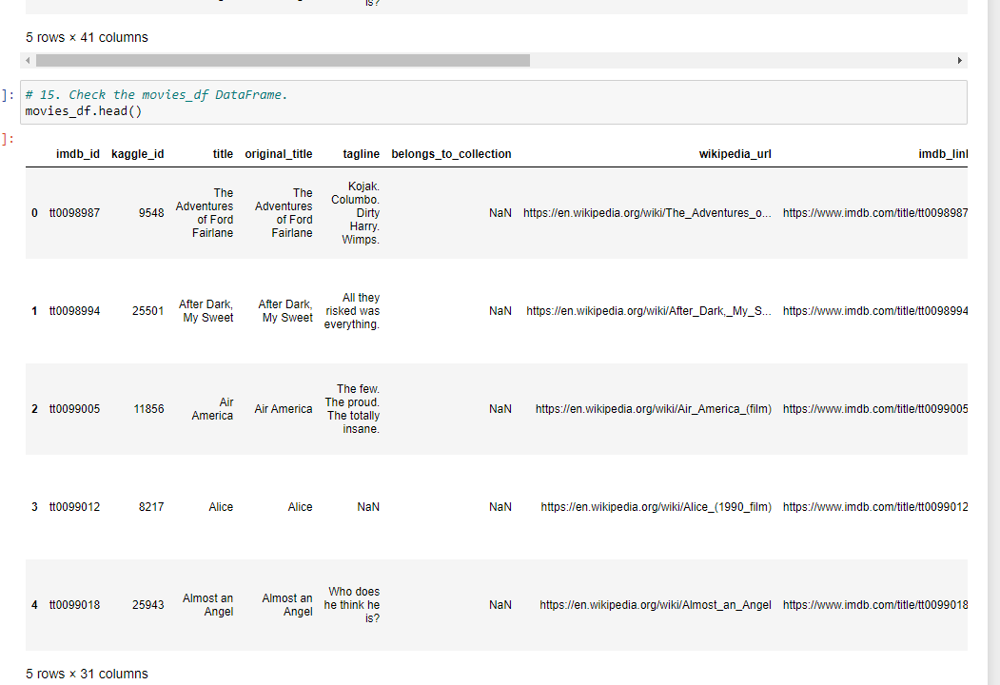
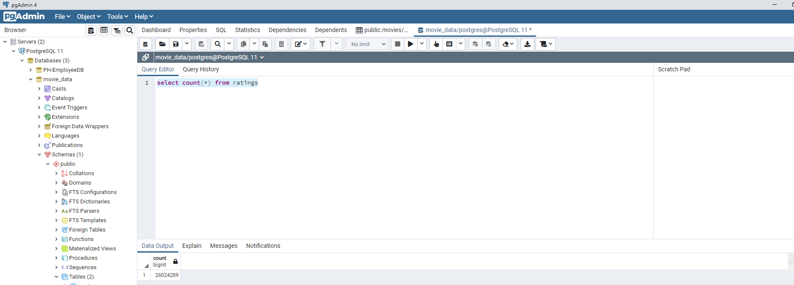

# Movies ETL

## Purpose
Amazing Prime loves the dataset and wants to keep it updated on a daily basis. Britta needs your help to create an automated pipeline that takes in new data, performs the appropriate transformations, and loads the data into existing tables. You’ll need to refactor the code from this module to create one function that takes in the three files—Wikipedia data, Kaggle metadata, and the MovieLens rating data—and performs the ETL process by adding the data to a PostgreSQL database.

## Results
In order to prepare the data for the upcoming Hackathon, I had to perform the following steps

### ETL Function Test
For this task, I had to write a function that reads the three data files and creates three separate DataFrames.

wiki_movies_df:

kaggle_metadata DataFrame:

ratings DataFrame:

### ETL Clean Wiki Movies
For this task, I had to write functions to extract and transform the Wikipedia data so that I could merge it with the Kaggle metadata.

Clean wiki_movies_df:

### ETL Clean Kaggle Data
For this task, I had to write code to extract and transform the Kaggle metadata and MovieLen ratings data, then convert the transformed data into separate DataFrames.

movies_with_ratings_df:

movies_df:

### ETL Create database
For this task, I had to utilize my skills in PostgreSQL to add the movies_df DataFrame and MovieLens rating CSV data into a SQL database.  Once the tables were create, I ran a query on the movies and ratings data sets.

Movies_query:

Ratings_query:

