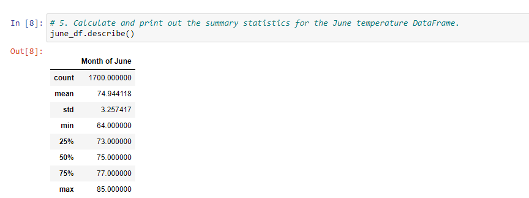
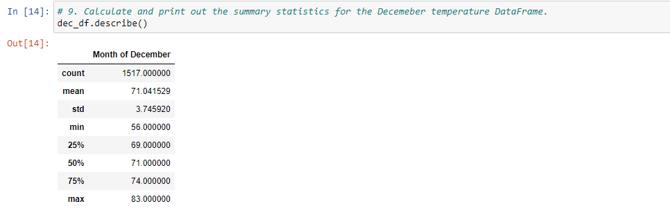
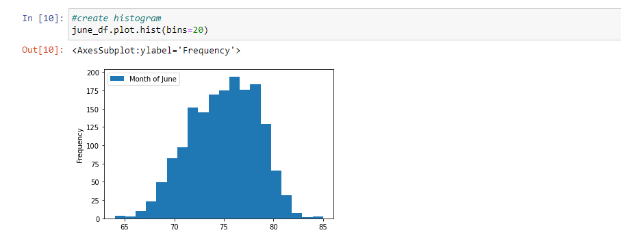
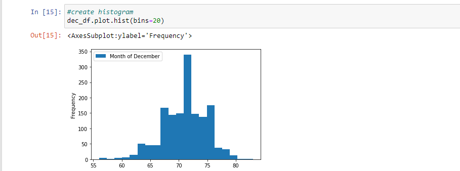

# Surfs Up with SQLAlchemy ORM

## Overview
W. Avy likes your analysis, but he wants more information about temperature trends before opening the surf shop. Specifically, he wants temperature data for the months of June and December in Oahu, in order to determine if the surf and ice cream shop business is sustainable year-round.

## Results
#####June Statistics:

#####December Statistics:

#####June Results:

#####December Results:

### What are some differences in the data?
* June has a temperature range of 21 Degrees (64-85) between the min and max while December has a 27 degree range (56-83)
* The average temperature in June is nearly 4 degrees higher (74.94) than December (71.04)
* According to the stats and spread of the histogram, you can expect the temperature to stay in the 73-77 degree range in June while you would expect it to be 69-74 degrees in December.
* The count of observed temperatures under 70 degrees is significantly higher than that of June.

## Summary
Based on the data observed, we can conclude that June is an average of 3-4 degrees warmer in Oahu than December.  The count of observed lower temperatures in December were significantly higher than that of June, leading us to conclude that there are more colder days present in December than June.  Taking this information into consideration, there would be much more down time in December, but the data reflects that at half of the month is warmer than 71 degrees.

### Additional Weather Analysis
* One query that could be performed to further explore the data would be to query the precipitation data to determine if the weather is much different in December than June.
* Another query that could be run, if the the data could be gathered, would be the time of day the temperature is observed.  Perhaps the lower temperatures were observed earlier in the day and rose throughout the day.  While there may be more cooler observations for December, it may get warm enough to justify operations in the mid-morning/afternoon.
