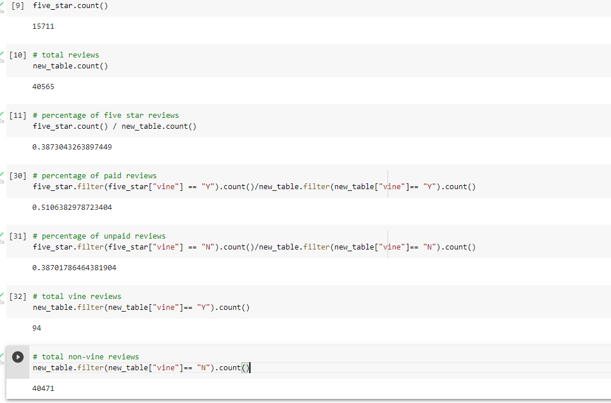

# Amazon Vine ETL

## Overview
In this project, I chose a data set from Amazon reviews regarding video games.  I used Pyspark to perform the ETL process by extracting the data, transforming the data, and connecting it to a database I generated on the AWS server.  My goal was to determine whether there is a favorable review biass from the Vine members for the video game dataset.

## Results 
* There were a total of 40,565 reviews after the filter of >20 votes and helpful votes/total votes was greater than 50%
* 94 total reviews were Vine Members, 40,471 of those were non-Vine members

### Analysis Snapshot:

### How many Vine reviews were 5 stars vs non-Vine 5-star reviews?
* In the data set, there were a total of 15,711 5-star reviews
* 15,663 of those reviews were Non-Vine, leaving 48 of those reviews to be vine users.

### What percentage of Vine reviews were 5 stars? What was the percentage for non-Vine?
* 51.1% of the Vine users gave 5-star reviews
* 38.7% of the non-Vine users gave 5-star reviews

## Summary
While there were significantly more non-Vine members leaving reviews, the overall percentage of Vine users left more 5-star reviews (51.1%).  Only 38.7% on non_vine users left 5-star reviews.  Using this information, we can conclude that there is, in fact, bias among the vine users.  To further evaluate this claim, I recommend running the same analysis vs 1,2,3, and 4-star reviews.  As you get lower in ratings, vine members should receive a lower percentage, unless those users are naturally more critical of their products as well as biased.  Another analysis that I think is necessary for providing an educated analysis would be to include verified vs unverified purchases to remove those reviews that are paid for or influenced by the seller/manufacturer.