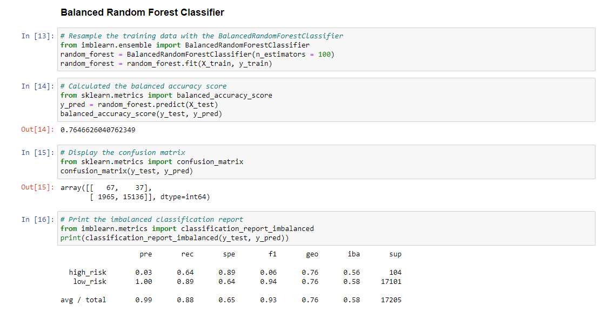

# Credit Risk Analysis

## Overview
Credit risk is tough to predict.  In this project, I needed analyze and predict whether someone is low or high risk based on the factors present in the 2019Q1 loan stats csv file provided.  This required me to create a model, then evaluate and train the models that they create.  To do this, I utilized the tools from the imbalanced0-learn and scikit-learn libraries to build the models and use a resampling method to evaluate them.  For some of the models, I oversampled the data using randomoversampler and SMOTE algorithms and undersampled the data with the clustercentroid algorithm.  In the other models, I used SMOTEENN to over and under sample the data.  Lastly, I used balancedrandomforestclassifier and easyensembleclassifier to compare the models with minimal bias.

## Results
* Naive Random Oversampling results: The balanced accuracy score is 64.7%.  The precision for the high_risk loans has a precision of 1% and a recall of 69%

* SMOTE Oversampling results: The balanced accuracy score is 66.2%.  The precision for the high_risk loans is also 1% and has a recall of 63%

* Undersampling results: The balanced accuracy score is 66.2%.  The precision for the high_risk loans is, again, 1% and has a recall of 69%

* Combination results: The balanced accuracy score is 54.5%.  The precision for the high_risk loans is 1% and has a recall of 72%

* Balanced Random Forest Classifier results: The balanced accuracy score is 76.5%.  The precision for the high_risk loans is 3% and has a recall of 64%

* Easy Ensemble AdaBoost Classifier results: The balanced accuracy score is 91.8%.  The precision for the high_risk loans is 9% and has a recall of 89%

## Summary
In the first four models I experimented with naive and smote oversampling, undersampling, and a combination of both to try and determine which model is best at predicting which loans are the highest risk. The next two models I resampled the data using balanced random forest and easy ensemble classifiers. In the first four models the accuracy score is not as high as the ensemble classifiers and the recall in the oversampling/undersampling/mixed models is low as well. Typically desirable models need a good balance of recall and precision which is why I recommend the easy ensemble classifiers over the first four models, since it had the best balance of all the models with its high accuracy score and precision/recall scores.