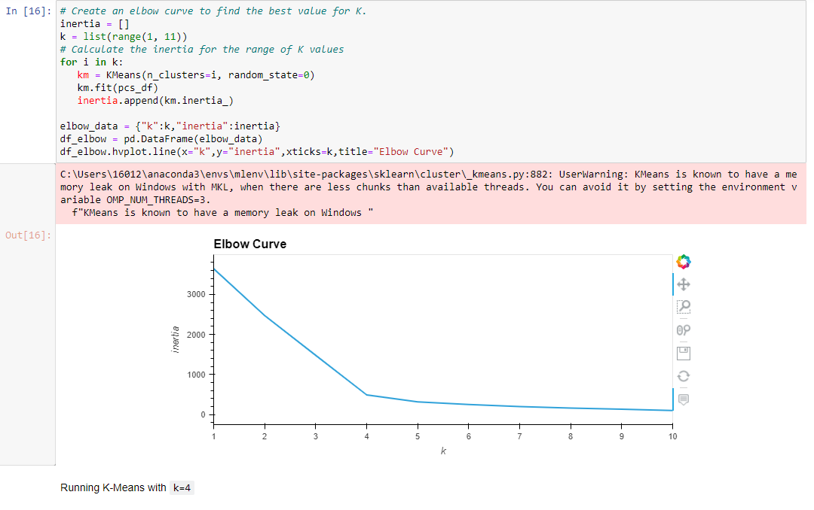
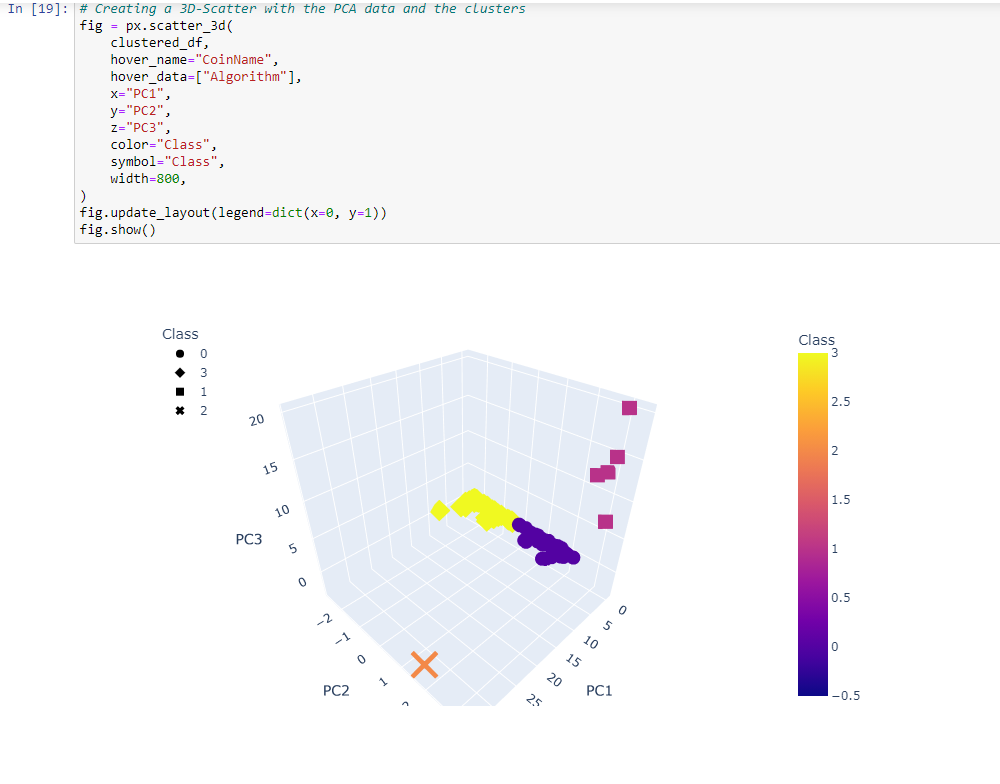
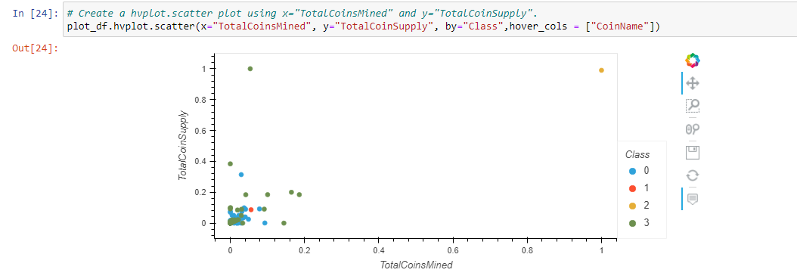

# Cryptocurrencies

## Purpose
For this challenge, I was tasked to preprocess data and reduce dimensions using PCA.  I also needed to cluster the data by k-means then visualize the results to determine if a cryptocurrency is tradable or not.

## Results
* The crypto_data.csv file contained data on 1252 Cryptocurrencies, 532 of which are tradable and meet parameters

### Finding the best k-value using the Elbow Curve
* running k-means with k=4

### 3D Scatter with Clusters:

### hvplot.scatter plot using x="TotalCoinsMined" and y="TotalCoinSupply"

