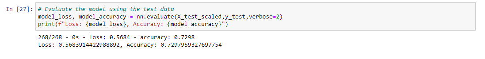
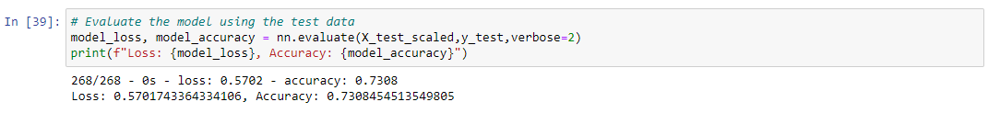
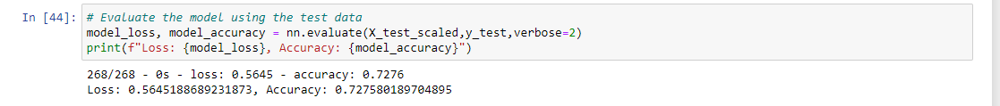

# Neural Network Charity Analysis

## Overview
The purpose of this project is to use deep-learning neural networks to analyze and classify the success of charitable donations in the dataset.  For this to be successful, I will need to preprocess the data for the neural network model. Next, I will need to compile, train, and evaluate the model.  Finally, I will bring it together and optimize the model, aiming for a goal of over 75%, if possible.

## Results
* The neural network model is made of of 2 hidden layers with 100 neurons and 30 neurons, in that order.
* The input data has 43 features and 25,724 samples
* The output layer is made of a unique neuron as its binary classification
* The final model accuracy is under 75%, an unacceptable performance standard for prediction
* In an attempt to increase performance, I: increased the number of neurons on one of the hidden layers, used a model with more hidden layers, and tried a different activation function (tanh)
* Even after optimization, model accuracy was below 75% 

### Optimization Attempt 1: Adding Neurons

### Optimization Attempt 2: Adding Hidden Layers

### Optimization Attempt 3: Different Activation Function

## Summary
The deep learning neural network model I created did not reach the target accuracy goal of 75%.  In the future, I could try using a supervised machine learning model, such as RandomForestClassifier, to combine the decision trees to generate a classified output and evaluate its performance against the deep learning model